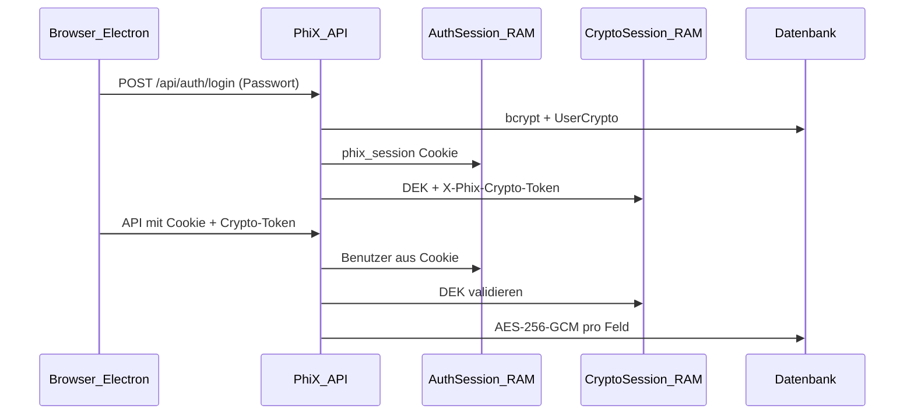

# PhiX – Sicherheit und Datenschutz

Übersicht der **Sicherheitsarchitektur**, des **Sicherheitschecks** (Stand Build 421) und der **verbleibenden Grenzen**. Technische Details zur Verschlüsselung: [`ENCRYPTION.md`](ENCRYPTION.md).

| Stand | Wert |
|-------|------|
| Letzte inhaltliche Aktualisierung | 2026-06-28 |
| Wesentliche Härtung | ab Build **421** (Auth-Cookie, Setup-Token, Admin-Gates) |
| Verschlüsselung eingeführt | ab Build **47** |

---

## Kurzantworten

| Frage | Antwort |
|-------|---------|
| Sind **alle** gespeicherten Daten verschlüsselt? | **Nein.** Fachliche Kerndaten (Namen, Noten, Listen, Fotos) sind verschlüsselt; Metadaten und einige Einstellungen bewusst im Klartext (siehe unten). |
| Schützt das Passwort vor **DB-Diebstahl**? | **Ja** für verschlüsselte Felder — ohne Passwort oder Recovery-Key ist der DEK nicht verfügbar; Ciphertext in PostgreSQL/SQLite ist nicht lesbar. |
| Kommt man **ohne Passwort** an Noten und Namen? | **Nicht** über die normalen Daten-APIs nach abgeschlossener Einrichtung. Randfälle (Netzwerk ohne TLS, XSS, kompromittierter Server) bleiben möglich (siehe Grenzen). |
| Ist PhiX **Ende-zu-Ende-verschlüsselt**? | **Nein.** Der Server entschlüsselt Daten während aktiver Krypto-Sessions im RAM — by design für die zentrale Schulinstallation. |

---

## Schutzziele

PhiX ist für den **Einsatz in der Schule** konzipiert: mehrere Lehrkräfte, ein Server (Docker) oder lokaler Desktop (Electron). Die Sicherheitsziele:

1. **Vertraulichkeit** von Schülernamen, Noten und Anhängen auch bei gestohlener Datenbankdatei oder Backup-Leak (ohne Passwort/Recovery).
2. **Trennung** der Benutzer: jeder Lehrkraft nur eigene Kurse (Admin sieht keine fremden Kursinhalte über die App-APIs).
3. **Integrität** der Verschlüsselung durch serverseitige Durchsetzung (Middleware + Prisma-Extension).
4. **Nachvollziehbare Authentifizierung** — keine Identität nur per manipulierbarem HTTP-Header.

---

## Architektur (zwei Ebenen)

| Ebene | Mechanismus | Speicherort Client | TTL / Gültigkeit |
|-------|-------------|-------------------|------------------|
| **Anmeldung** | HttpOnly-Cookie `phix_session` | Cookie (nicht per JS lesbar) | ca. 7 Tage (Server-RAM) |
| **Datenzugriff** | Header `X-Phix-Crypto-Token` | `sessionStorage` | 5 Min. Inaktivität (verlängerbar) |
| **Passwort** | bcrypt-Hash in DB | nie gespeichert | — |
| **DEK** | Argon2id-Hülle (Passwort + Recovery) | nur Server-RAM während Session | — |

Relevante Implementierung: [`backend/lib/auth-session.js`](../backend/lib/auth-session.js), [`backend/lib/crypto-session.js`](../backend/lib/crypto-session.js), [`backend/lib/crypto-middleware.js`](../backend/lib/crypto-middleware.js).

---

## Verschlüsselte Inhalte

Pro Benutzer ein zufälliger **DEK** (256 Bit), Felder mit **AES-256-GCM**, Format `enc:v1:` + Base64(IV + Auth-Tag + Ciphertext). Katalog: [`backend/lib/encryption-registry.js`](../backend/lib/encryption-registry.js).

| Bereich | Verschlüsselte Felder (Auswahl) |
|---------|----------------------------------|
| Kurse | `year`, `className`, `subject`, `weighting`, Notenschlüssel, Stash-JSONs |
| Schüler | `firstName`, `lastName`, Gesamtnoten, Notizen |
| Schülerverwaltung | `label`, Namen |
| Leistungsnachweise | Klausuren, Tests, Mündlich, Projekte, GFS, Referate (`scores`, `grades`, …) |
| Klassenlehrer-Listen | Betreff, Notizen, externe Namen, Bemerkungen |
| Album / Auswertungshilfe | Titel, Beschreibung, Bild-/Dateidaten |

Ohne gültigen **Krypto-Token** antworten Daten-APIs mit **HTTP 423** (außer Login, Session, Setup, Initial-Password, Recovery).

---

## Bewusst unverschlüsselt (Metadaten)

Diese Daten ermöglichen Struktur, Indizes und UI-Logik; ein DB-Dump zeigt **Anzahl und Zuordnung**, aber keine Namen/Noten in den verschlüsselten Feldern:

| Daten | Beispiel-Risiko |
|-------|-----------------|
| IDs, `ownerUsername`, `courseId` | Wer wie viele Kurse/Schüler hat |
| `studentNumber`, `frontendId` | Nummerierung, keine Namen |
| `SchoolRosterStudent.gradeLevel`, `classSection` | Klassenstufe ohne Namen |
| Kurs-Booleans (`archived`, `gfsAccepted`, …) | Feature-Konfiguration |
| `UserSettings` | Dark Mode, Farbschema, Timeout |
| `AppUser.username`, `isAdmin` | Benutzerliste (Admin-API) |

---

## Authentifizierung und Autorisierung (ab Build 421)

### Umgesetzte Maßnahmen

| Maßnahme | Beschreibung |
|----------|--------------|
| **Server-Session** | `phix_session`-Cookie nach Login/Recovery; kein `X-Acting-User` mehr vom Client |
| **Crypto-Setup** | `POST /api/auth/crypto/setup` prüft Passwort gegen bcrypt |
| **Erstpasswort** | Einrichtungs-Token vom Admin (bcrypt-Hash in DB); Rate-Limit; Bootstrap-`admin` ohne Token |
| **Benutzerverwaltung** | `GET`/`POST /api/users` nur für Administratoren |
| **Herunterfahren** | `POST /api/shutdown` nur für Administratoren mit gültiger Session |
| **Prisma fail-closed** | Lese-/Schreibzugriff auf verschlüsselte Modelle ohne DEK → Fehler |
| **CORS** | Standard: lokale Origins; erweiterbar via `PHIX_CORS_ORIGINS` |

### Ablauf neuer Benutzer

1. Admin legt Benutzer an → Response enthält **Einrichtungs-Token** (einmalig anzeigen/weitergeben).
2. Nutzer setzt auf der Anmeldeseite **Erstes Passwort** (mit Token).
3. Nach Login: **Verschlüsselung einrichten** → Recovery-Key anzeigen und sicher aufbewahren.
4. Ab dann: normale Arbeit mit Passwort + Krypto-Session.

Details und API-Tabelle: [`ENCRYPTION.md`](ENCRYPTION.md).

---

## Sicherheitscheck – Ergebnisse

Im Review (Build 421) wurden folgende **Befunde** identifiziert und **behoben** bzw. dokumentiert:

| Befund (vorher) | Schwere | Status ab Build 421 |
|-----------------|---------|---------------------|
| Crypto-Setup ohne Passwort-Verifikation | Kritisch | **Behoben** (bcrypt-Prüfung) |
| Initial-Password-Race bei neuen Konten | Hoch | **Behoben** (Setup-Token + Rate-Limit) |
| Header-only Auth (`X-Acting-User`) | Hoch | **Behoben** (HttpOnly-Cookie) |
| `POST /api/users` ohne Admin | Hoch | **Behoben** |
| Prisma fail-open ohne DEK | Mittel | **Behoben** (fail-closed) |
| Unverschlüsselte Stash-JSONs am Kurs | Mittel | **Behoben** (im Registry) |
| HTTP ohne TLS im Docker-LAN | Mittel | **Doku + Pflichtempfehlung** (Abschnitt TLS) |
| XSS + Crypto-Token in sessionStorage | Mittel | **Offen** (architekturbedingt) |
| Kein E2E (Server sieht Klartext in Session) | Mittel | **By design** dokumentiert |

### Was ohne Passwort **nicht** geht (positiv)

- Lesen/Schreiben von Kursen, Schülern, Noten über Standard-APIs → **423** ohne Krypto-Token.
- Login → bcrypt; DEK nur mit Passwort oder Recovery-Key.
- Fremde Kurse → `ownerUsername`-Prüfung; Admin ohne fremden Recovery-Key kein Klartext fremder Backups.
- Passwort ändern → `oldPassword` und DEK re-wrap erforderlich.

### Verbleibende Angriffsvektoren (Grenzen)

| Vektor | Risiko | Empfehlung |
|--------|--------|------------|
| **Netzwerk ohne TLS** | Passwort, Cookie, Token mitlesbar | HTTPS Reverse-Proxy vor Port 1990; `PHIX_COOKIE_SECURE=1` |
| **XSS im Frontend** | Diebstahl `X-Phix-Crypto-Token` bis TTL | Vertrauenswürdige Umgebung; Browser aktuell halten |
| **Kompromittierter Server** | DEK im RAM während Sessions | Server absichern; kein E2E-Modell |
| **Verlorener Recovery-Key + Passwort** | Daten unwiederbringlich | Recovery-Key sicher archivieren |
| **Physischer Zugriff Desktop** | SQLite-Datei kopierbar (Ciphertext) | Rechner/USB schützen; OS-Anmeldung |
| **Admin-Raw-Backup** | Ciphertext + `userCrypto`-Hüllen | Backup-Medium schützen |

---

## Backup und Wiederherstellung

| Typ | Inhalt | Schutz |
|-----|--------|--------|
| **Mein Backup** (decrypted) | Klartext | Nur mit eigener Krypto-Session |
| **Mein Backup** (raw) | Ciphertext | Wie DB |
| **Voll-Backup (Admin)** | Alle Benutzer, raw | Admin-Session; Klartext fremder Nutzer nur mit Recovery-Key |

Backups variantenübergreifend (Docker ↔ Desktop) bei kompatiblem Schema. Siehe [`ENCRYPTION.md`](ENCRYPTION.md).

---

## Betrieb: Checkliste

### Docker-Server (Schulnetz)

- [ ] **HTTPS** vor dem Frontend (Pflicht im LAN) — [`INSTALL_SERVER_UND_DESKTOP_WINDOWS.md`](INSTALL_SERVER_UND_DESKTOP_WINDOWS.md) Abschnitt 1.8
- [ ] `PHIX_COOKIE_SECURE=1` hinter TLS
- [ ] Firewall: nur benötigte Ports (z. B. 1990/443, nicht 3000/5432 nach außen)
- [ ] Nach Updates: `npx prisma migrate deploy` im Backend-Container
- [ ] Regelmäßige **verschlüsselte Backups**; Raw-Backups und Recovery-Keys getrennt schützen

### Electron-Desktop

- [ ] Installationsordner und `data/phix.db` vor fremdem Zugriff schützen
- [ ] Recovery-Keys der Benutzer dokumentiert aufbewahren
- [ ] USB-Kopien der App nur mit vollem Ordner inkl. `data/`

### Für alle Installationen

- [ ] Starke Passwörter; Erstpasswort nur mit **Einrichtungs-Token**
- [ ] Recovery-Key nach Krypto-Setup **einmalig** sichern
- [ ] Admin-Konto `admin` nicht löschen; weitere Admins sparsam vergeben

---

## Umgebungsvariablen (Sicherheit)

| Variable | Zweck |
|----------|--------|
| `PHIX_CORS_ORIGINS` | Kommagetrennte erlaubte Origins (Standard: lokale Ports) |
| `PHIX_COOKIE_SECURE=1` | Secure-Flag für Session-Cookie (hinter HTTPS) |

Beispiele: [`backend/.env.example`](../backend/.env.example).

---

## Verwandte Dokumentation

| Thema | Datei |
|-------|--------|
| Verschlüsselung, API, KDF | [`ENCRYPTION.md`](ENCRYPTION.md) |
| TLS / Docker-Installation | [`INSTALL_SERVER_UND_DESKTOP_WINDOWS.md`](INSTALL_SERVER_UND_DESKTOP_WINDOWS.md) |
| SQLite Desktop, lokale DB | [`SQLITE_DESKTOP.md`](SQLITE_DESKTOP.md) |
| Prisma Dual-Schema | [`ADR-002-prisma-postgres-sqlite.md`](ADR-002-prisma-postgres-sqlite.md) |

---

## Änderungshistorie (Sicherheit)

| Build | Änderung |
|-------|----------|
| 47 | Feldverschlüsselung AES-256-GCM, Recovery-Key, Backup v2 |
| 421 | Auth-Cookie, Setup-Token, Admin-Gates, fail-closed Prisma, Stash-Felder verschlüsselt, CORS, Security-Doku |
